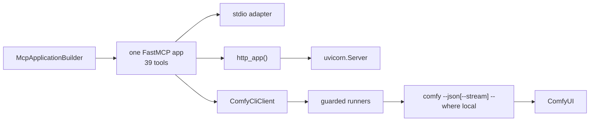

# FastMCP 4 shared-application design

Status: implemented for the `comfy-mcp` 0.10 development line
Framework baseline: `fastmcp==4.0.0b3`, `mcp==2.0.0`

## Decision

`comfy-mcp` has one FastMCP application and two mutually selected transport
adapters:

```text
McpApplicationBuilder.build() -> server.mcp (39 registered tools)
                                  ├── stdio: mcp.run(transport="stdio")
                                  └── HTTP:  mcp.http_app(...) -> uvicorn
```

The application name, version, instructions, machine snapshot, tool registry,
schemas, results, consent gates, and `ComfyCliClient` path are therefore
identical in both modes. HTTP is not a second product API and has no separate
tool allowlist or DTO/VO translation layer.

## Why a builder

FastMCP does not infer the installed application version. A tiny immutable
`McpApplicationBuilder` owns the three constructor inputs that must not drift:

- application name;
- installed version;
- base handshake instructions.

Production calls `build()` once. Tool decorators then register on the returned
`server.mcp`. Transport is intentionally absent from the builder because it is
a process-start decision, not application identity.

This is the whole builder pattern here. There is no generic provider graph,
repository hierarchy, transport registry, or second application factory.

## Server package boundary

The Python API mirrors the single-application design without exposing runtime
details:

```text
comfy_mcp.server
├── __init__.py       public: mcp, main, 39 tool callables
├── tools.py          explicit public tool exports
├── cli.py            console argv and stdio/HTTP mode selection
├── config.py         validated HTTP listener settings
├── instructions.py   shared handshake instructions
├── mcp_app.py        one FastMCP application builder
├── remote.py         HTTP ASGI/uvicorn adapter
└── _internal.py      private runners, state, implementations, startup
```

`__init__.py` and `tools.py` expose the exact objects created and registered by
`_internal.py`; they do not wrap calls, construct another FastMCP instance, or
maintain parallel state. Tests of private mechanics import
`comfy_mcp.server._internal` explicitly. Normal consumers import only
`comfy_mcp.server`, whose `__all__` is the supported boundary.
Keeping these entry/composition modules in `server/` separates them from the
package-level public types (`ComfyCliError`, `SlotOverride`, `SlotVariants`) and
from reusable leaf helpers without introducing another abstraction layer.

`comfy_mcp.file_transfer` is the one package-level leaf for the HTTP filesystem
boundary. It validates the Cloud-compatible upload request, owns single-use
upload tokens plus signed download tokens, and handles expiry/cleanup; it
neither imports the server package nor talks to ComfyUI. `_internal.py`
composes it with the same `ComfyCliClient` upload/download calls used by stdio.

## Runtime composition



Bare `comfy-mcp` selects stdio. `comfy-mcp serve` validates listener settings,
then passes the exact same `server.mcp` object to the HTTP adapter.

The HTTP adapter only calls FastMCP's public:

```python
mcp.http_app(
    path=config.path,
    transport="http",
    json_response=True,
    stateless_http=True,
    host_origin_protection="auto",
    allowed_hosts=...,
    allowed_origins=[],
)
```

The returned ASGI app is handed to an explicit `uvicorn.Server`. FastMCP owns
JSON-RPC, validation, modern/legacy negotiation, request context, Streamable
HTTP, and ASGI lifespan. This project does not implement JSON-RPC, legacy SSE,
reconnect logic, or private session patches.

`stateless_http=True` keeps pre-initialize and stale-session requests from
addressing persisted server session state. Long jobs should still use
submit/poll (`wait=False`, then `job`) rather than depend on a long HTTP
response.

The shared application also registers two public `custom_route`s before either
transport is selected: single-use PUT at `/api/uploads/{token}` and signed GET
at `/downloads/{token}/{filename}`. In HTTP mode, `upload_file` mints the first;
its handler stages the request owner-only and calls the shared upload runner.
`fetch_outputs` first calls `comfy download` into owner-only scratch, then mints
a five-minute HMAC-signed capability on the second. Both remain on the same
FastMCP ASGI application and listener: there is no second server, port, session
system, or transport-specific tool registry. stdio uses direct paths.

## Remote filesystem boundary

MCP tool arguments are JSON, so a client-local pathname does not make the file
visible to a remote MCP process. `upload_file(file_path, client_os)` therefore
uses the same contract as ComfyCloud: stdio reads the absolute client path;
HTTP returns a credential-free command that PUTs the file to a five-minute,
single-use capability. The route is limited to the validated image filename
bound at mint time and 50 MiB, stages owner-only, hands only its generated path
to the existing async `comfy upload` runner, and removes it on every exit. Raw
request bytes are never subprocess arguments or failure-log fields.

The inverse boundary applies to `fetch_outputs`: HTTP `out_dir` is a desired
client path, not a server write target. The response rewrites scratch paths to
that client destination and supplies a signed URL plus one command selected by
`client_os` (with structured aliases retained for programmatic clients).
Only comfy-cli-reported regular files contained by the scratch root can be
published. Links are non-cacheable, signature/expiry checked, and removed after
five minutes. A reverse proxy must forward `/api/uploads/` and `/downloads/` as
well as `/mcp`.

## Shared engine client

All tools reach comfy-cli through `ComfyCliClient`:

```text
tool -> client/context.py -> ComfyCliClient
     -> sync/async/streaming guarded runner -> comfy binary
```

The client boundary imports no MCP server and opens no direct ComfyUI HTTP
connection. A request-local `ContextVar` supports test injection and prevents
concurrent HTTP tasks from sharing a mutable current-client field.

## Failure log observer

Failure logging is intentionally a small observer pattern:

```text
runner failure -> _log_failure(...) -> immutable _FailureEvent
                                      -> JSONL observer
```

The JSONL writer is the sole default observer. When
`COMFY_MCP_DEBUG_LOG` is unset, empty, or `0`, it returns before touching the
filesystem. When enabled, it preserves the existing owner-only permissions,
rotation, URL credential/query scrubbing, bounded stream tails, and
failure-only behavior.

The publisher isolates observer exceptions so diagnostics can never replace a
real `ComfyCliError`. This is not a general event bus: no priorities, async
broker, plugin discovery, replay, or persistent queue are needed.

## Addressing and security

The two normal ports describe different processes:

- ComfyUI: usually `127.0.0.1:8188`, optionally selected with
  `COMFY_LOCAL_URL`;
- MCP Streamable HTTP: for example `127.0.0.1:9000/mcp`, selected with
  `COMFY_MCP_*` or `serve` flags.

`COMFY_BIN` and `COMFY_API_KEY` belong to the `comfy-mcp` server process in
both modes. A remote ComfyUI target remains a separate `COMFYUI_URL` or
`COMFYUI_HOST`/`COMFYUI_PORT` concern.

The HTTP listener defaults to loopback. Non-loopback binds require explicit
Host patterns for DNS-rebinding protection. That is not authentication: HTTP
exposes all 39 tools, including lifecycle and installation tools, so an
untrusted-network deployment belongs behind an authenticated TLS reverse
proxy. Existing MCP elicitation, comfy-cli consent, and argument guards remain
active in both transports.

## LightRAG lessons retained

The LightRAG history remains useful as regression evidence:

- do not pass unsupported transport names to an older SDK;
- do not fall back to deprecated SSE;
- do not monkeypatch private session methods or swallow broad runtime errors;
- do not build separate stdio/HTTP applications or backend paths;
- do not write application logs to stdio stdout.

The useful reference pattern is its client boundary. Here the outbound client
is comfy-cli rather than an HTTP API.

## Required tests

The affected test layers are:

1. `test_remote_transport.py`: builder identity, no second FastMCP constructor,
   exact-instance ASGI adaptation, listener validation, and interrupt cleanup.
2. `test_fastmcp_app.py`: one in-process application, full business flow, and
   modern/legacy consent.
3. `test_stdio_business_flow.py`: real stdio child plus fake executable,
   covering `server_info -> run_workflow -> job -> fetch_outputs`.
4. `test_remote_http.py`: real loopback HTTP over the same 39 tools and the
   same complete upload/submit/poll/signed-fetch business flow, plus failure
   observation, negotiation, concurrency, stale requests, and lifecycle.
5. `test_file_transfer.py`: Cloud-compatible schema/commands, single-use upload
   limits and exact bytes, path containment, scratch cleanup, signed downloads,
   and failure-log non-disclosure.
6. `test_failure_log.py`: opt-in behavior, immutable event delivery, observer
   isolation, scrubbing, permissions, rotation, and concurrency.
7. `tests/e2e`: separately marked live ComfyUI smoke. A missing real `comfy`
   binary must be reported as a skip, never described as a live pass.

Every transport/client/logging change runs the focused layers first, then the
full pytest, lint, format, dependency, and diff checks.

## Acceptance criteria

- production contains one `FastMCP(...)` constructor and one built application;
- stdio and HTTP each discover the same 39 tools;
- both complete the upload/submit/poll/fetch business flow through
  `ComfyCliClient`; HTTP fetch returns a working short-lived signed URL on the
  MCP listener;
- both report the same instructions and installed version;
- HTTP uses public `http_app()` plus uvicorn, with no SSE/session patch;
- failure logging is an opt-in observer with zero disabled filesystem effects;
- automated tests and static checks pass; live E2E is reported separately.
